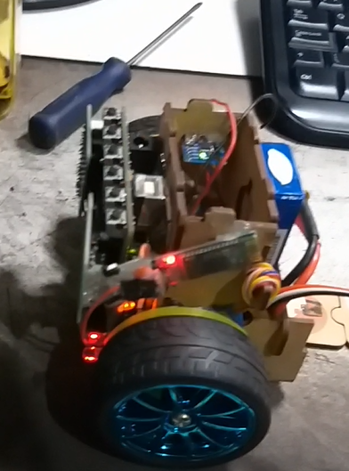

<!-- Headings --> <!-- Strong --> <!-- Italics --> <!-- Blockquote --> <!-- Links --> <!-- UL --> <!-- OL --> <!-- Images --> <!-- Code Blocks --> <!-- Tables --> 
<!-- Task Lists -->

> # Decabot New Version from Firmware

### First of all, this project is a remix from the [original project](https://github.com/Yuri-Lima/firmware_robot), where i just built new firmware and included some hardware to try cooperate with it.

> ## The biography studied:

#### 3D Wheel
* https://www.thingiverse.com/thing:862438/files

#### Productivity metrics and automatic time tracking for programmers
* https://wakatime.com/projects 

#### Engine reduction mechanism
* https://youtu.be/B86nqDRskVU

#### Batery Level
* https://www.automalabs.com.br/como-medir-a-tensao-de-alimentacao-do-arduino/

#### RFID record and write
* https://www.filipeflop.com/blog/como-gravar-dados-no-cartao-rfid/

#### Dynamic allocation memory
* https://youtu.be/g2Tco_v73Pc

#### Incremental encoder - animation
* https://youtu.be/zzHcsJDV3_o

### Right Angle Triangle Theorem SOH CAH TOA  
* https://youtu.be/TjC3F9sj-x0 
* https://www.youtube.com/watch?v=3iHUX_oOcX0 
* https://www.dobitaobyte.com.br/sirene-com-arduino/ 

### Over in the Air com HC 05 
* https://youtu.be/xXUKfTNHkKE?list=PL4vok-JSscqD_f4F9JEucI_fXp49GaD4L
* https://sites.google.com/site/wayneholder/inexpensively-program-your-arduino-via-bluetooth

### MPU6050
* https://github.com/tockn/MPU6050_tockn

> ## What was the changes

1. The main code;
1. External reset button when something went wrong, like a bug;
1. [MPU 6050](https://github.com/Yuri-Lima/CodeDomino_NewFirmwares/blob/master/Code_MPU_PID/App_MPU6050_PID.ino)
1. [Posicion Corret MPU6050](https://youtu.be/N3V8oYgs7Ro)
1. Examples code to simulate individual part of the code:
  - [Gravador_Tag, Passo_Caminhar, Read_Write, StringToInt, eeprom_get, eeprom_put, memset](https://github.com/Yuri-Lima/CodeDomino_NewFirmwares/tree/master/Simula%C3%A7%C3%B5es)
1. Libraries Created
  * [SoundCod.h](https://github.com/Yuri-Lima/CodeDomino_NewFirmwares/tree/master/libraries/SoundCod)
  * [ButtonCod.h](https://github.com/Yuri-Lima/CodeDomino_NewFirmwares/tree/master/libraries/Button)
  * [RecordFlash.h](https://github.com/Yuri-Lima/CodeDomino_NewFirmwares/tree/master/libraries/RecordFlash)
  * [SoundCod2.h](https://github.com/Yuri-Lima/CodeDomino_NewFirmwares/tree/master/libraries/SoundCod2)
      * License from: https://creativecommons.org/licenses/by-sa/4.0/  
      * Part of the code from: https://github.com/OttoDIY/DIY
  * [BatLevelCod.h](https://github.com/Yuri-Lima/CodeDomino_NewFirmwares/tree/master/libraries/BatLevelCod)
  * [BlueDebug.h](https://bitbucket.org/apiice/firmware_robot/commits/d7aabaa0ca106b523513a8d5e12650b8c50fb360)

> ## Hardware

1. The main board from the original project;
1. Bluetooth HC 05 plus General Components;
1. MPU6050;

> ## Software
1. VsCode;
1. Arduino IDE;

> ## Protoypes Images and Videos
* [Posicion Corret MPU6050](https://youtu.be/N3V8oYgs7Ro)
* [Simples Tests](https://youtu.be/KEpbW0obaI0)
* [First tests using the MPU6050 into the project CodeDomino](https://youtu.be/_bp6ZzDUpjY)
* [Great results with MPU6050](https://youtu.be/3xucGsFeTs0)

> ### Contact

> **Atention** If you go email me, please put as subject the name of the project, in this case: **(CodeDominor Remixer) Requests**

|  Name |  Email | Mobile  |
|-------|--------|---------|
|  Yuri Lima | y.m.lima19@gmail.com  | +353 83 419.1605  |   
