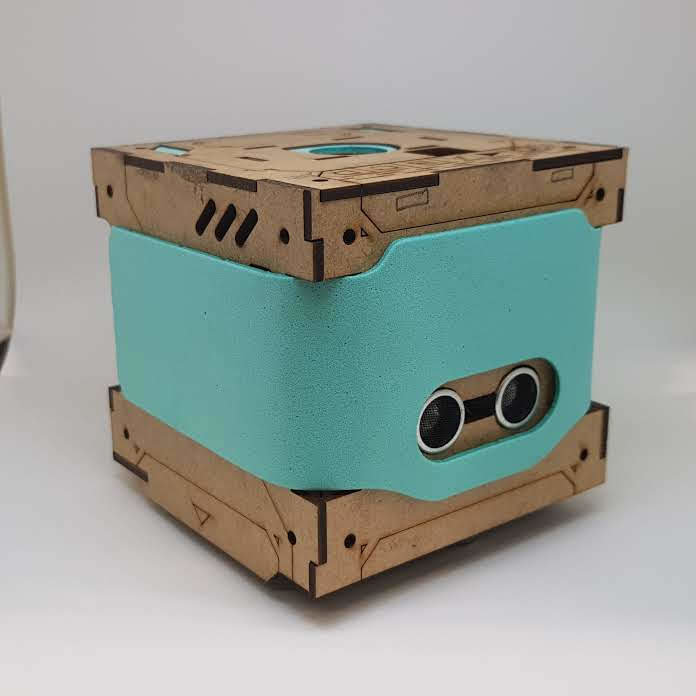

<!-- Headings --> <!-- Strong --> <!-- Italics --> <!-- Blockquote --> <!-- Links --> <!-- UL --> <!-- OL --> <!-- Images --> <!-- Code Blocks --> <!-- Tables --> 
<!-- Task Lists -->

> # Decabot New Version from Firmware

### For you knowledge, this project is a remix from the [original project](https://github.com/Yuri-Lima/firmware_robot). I had just built a new firmware and included some hardware to cooperate with it.

> ## Basic Notice

* Walk / 0 -> Stopped function, 1 -> forward, -1 -> back 
  * This function controls all the execution of steps, in any direction, even curves. 
  
* As the basic guidelines are no longer a mystery. 
  * I will try to explain a little about how I tried to solve the curve problem, as follows: 
    * I noticed that one of the wheels needs to take fewer steps than the other, of course according to the direction, so I found a reason given by the parameter _freqRot, he is responsible, for inhibiting certain steps with a ratio between the steps to walk and the rest comparable to 1, in this rhythm, when varying this division, we can get drives that vary from 1 step each 2, such as 1 step every 5 and so on, so, the larger _freqRot, the longer the activation time for 1 step and the circumference / curve radius decreases, that is, it is inversely proportional. 
    * All calculations for making circular movements, that is, curves, must be used as a variable parameter, e_360, because it is there that we have the steps, taking into account the axis of the car and all to follow in a straight line, either backwards or forwards, has as parameter / variable r_360. 
    * Other calculations are just simple rules 3. In the function Shapes case 4, Sine and Tagente were used, because to perform it is necessary to create a Rectangle Triangle just specifying the type of the notable triangle and the opposite side measurement, to obtain the other measures . 
    * Anyway, I saw that we have a lot to do, both for an open version, as for a commercial version better elaborated in the sense (precision). 
    * Over in the Air with HC 05 / The entire implementation followed the guidelines of the links I made available, there are details that need to be studied further. Example: time spent in pairing. Pair automatically with a predefined list of devices.

> ## What was the changes

1. The main code;
1. External reset button when something went wrong, like a bug;
1. [MPU 6050](https://github.com/Yuri-Lima/CodeDomino_NewFirmwares/blob/master/Code_MPU_PID/App_MPU6050_PID.ino)
1. [Posicion Corret MPU6050](https://youtu.be/N3V8oYgs7Ro)
1. Examples code to simulate individual part of the code:
  - [Gravador_Tag, Passo_Caminhar, Read_Write, StringToInt, eeprom_get, eeprom_put, memset](https://github.com/Yuri-Lima/CodeDomino_NewFirmwares/tree/master/Simula%C3%A7%C3%B5es)
1. Libraries Created
  * [SoundCod.h](https://github.com/Yuri-Lima/CodeDomino_NewFirmwares/tree/master/libraries/SoundCod)
  * [ButtonCod.h](https://github.com/Yuri-Lima/CodeDomino_NewFirmwares/tree/master/libraries/Button)
  * [RecordFlash.h](https://github.com/Yuri-Lima/CodeDomino_NewFirmwares/tree/master/libraries/RecordFlash)
  * [SoundCod2.h](https://github.com/Yuri-Lima/CodeDomino_NewFirmwares/tree/master/libraries/SoundCod2)
      * License from: https://creativecommons.org/licenses/by-sa/4.0/  
      * Part of the code from: https://github.com/OttoDIY/DIY
  * [BatLevelCod.h](https://github.com/Yuri-Lima/CodeDomino_NewFirmwares/tree/master/libraries/BatLevelCod)
  * [BlueDebug.h](https://bitbucket.org/apiice/firmware_robot/commits/d7aabaa0ca106b523513a8d5e12650b8c50fb360)

> ## Analysis of the power consumption
 
CodeDomino Acording of the test made at **25/10/2018 at 23:07**. The power consumption was around ~95mA when it is stopped **waiting to receve the first command**, however, when the first command comes up, The power **minimun consumption** when it was working at around 495mA e **max was 700mA** at the end of the way. There is a pico of energy, when the bobine of the motors turns off. The **Lipo Batery 2S de 1300mAh** has a range aprox in 4 hours of work. 
O.B.S.: It's still necessary wacht his behavior, because all of the informatios is just piece of ideia, however, i considerated all experience that i had  at the long way doing the tests. 
- **Calculate Base when it is stopped**: Lipo 1000mAh--> 1 / 0,095 = 10.526 * 60min = 631 minutes ou 10 horas stopped. 
- **Calculate Base when it is works**: Lipo 1000mAh--> 1 / 0,5 = 2 * 60min = 120 minutes ou 2 hours.

> ## Calculates to show how the robot moves

* --> May you can ask <-- 
- How many steps are to turn **the wheel** self around into 360º? --> go to **step number 2 **
- How many steps are to turn **the robot** self around into 360º??  --> go to **step number 4**
```
Step 1 - Motor
1º We need to know, which will be the model of the step motor to know how many degrees per step. 
2º We are going to divide 360° by degrees steps of the type of motor to get how many steps are necessary to turn the wheel self around into 360°.
O.B.S.: It is important to add one variable to incrise(+) a margin of error, because there are few oscillations.

```
- http://robocraft.ru/files/datasheet/28BYJ-48.pdf 

| Exemples|Type of motor|Stpes|
|---------|-------------|-----|
| FullStep = 11,25° / 64 => 0.1757°|28BYJ-48|0.1757°|
| 1Step = 5.625 --> FullStep = 2 * 5.625° => 11,25° ---> 360 / 0.1757°|28BYJ-48|p' = 2000 steps|

```
Step 2 - The Wheel                                  
1º We need the information of the diameter of the wheel to get radius.
2º At the formula C" = 2 * PI * r --> we can get the log distance at 360°.

Step 3 - The Car
1º We need to get the diameter between of the two wheel, to get radius.
2º t the formula C' = 2 * PI * r --> we can get the log distance at 360°, however, on its own axis.

Step 4 - Revolution                   
1º revolution = C" / C' --> How many stpes the wheel of the car, will have to do to the car turns 360° on its own axis.

Step 5 - Steps 
1º P" = p' * revolution --> At P" We can get how many steps to turn 360°.

O.B.S.: It is important to add one variable to incrise(+) a margin of error, because there are few oscillations. Recomended >= 0.01

Important details, everything that go to relate about moviment of the curve, we use the variable called e_360 and straight movement r_360.

```

> ## Hardware

1. The main board from the original project;
1. Bluetooth HC 05 plus General Components;
1. MPU6050.

> ## Software
1. VsCode;
1. Arduino IDE;
1. SolidWorks.

> ## The biography studied:

#### 3D Wheel
* https://www.thingiverse.com/thing:862438/files

#### Productivity metrics and automatic time tracking for programmers
* https://wakatime.com/projects 

#### Engine reduction mechanism
* https://youtu.be/B86nqDRskVU

#### Batery Level
* https://www.automalabs.com.br/como-medir-a-tensao-de-alimentacao-do-arduino/

#### RFID record and write
* https://www.filipeflop.com/blog/como-gravar-dados-no-cartao-rfid/

#### Dynamic allocation memory
* https://youtu.be/g2Tco_v73Pc

#### Incremental encoder - animation
* https://youtu.be/zzHcsJDV3_o

#### Right Angle Triangle Theorem SOH CAH TOA  
* https://youtu.be/TjC3F9sj-x0 
* https://www.youtube.com/watch?v=3iHUX_oOcX0 
* https://www.dobitaobyte.com.br/sirene-com-arduino/ 

#### Over in the Air com HC 05 
* https://youtu.be/xXUKfTNHkKE?list=PL4vok-JSscqD_f4F9JEucI_fXp49GaD4L
* https://sites.google.com/site/wayneholder/inexpensively-program-your-arduino-via-bluetooth

#### MPU6050
* https://github.com/tockn/MPU6050_tockn

> ## Protoypes Images and Videos
##### Click on the text below to watch on Youtube Channel
* [Posicion Corret MPU6050](https://youtu.be/N3V8oYgs7Ro)
* [Simples Tests](https://youtu.be/KEpbW0obaI0)
* [First tests using the MPU6050 into the project CodeDomino](https://youtu.be/_bp6ZzDUpjY)
* [Great results with MPU6050](https://youtu.be/3xucGsFeTs0)

##### Images




> ## Contact
**Atention** If you go email me, please put as subject the name of the project, in this case: **(CodeDominor Remixer) Requests**

|  Name |  Email | Mobile  |
|-------|--------|---------|
|  Yuri Lima | y.m.lima19@gmail.com  | +353 83 419.1605  |   
